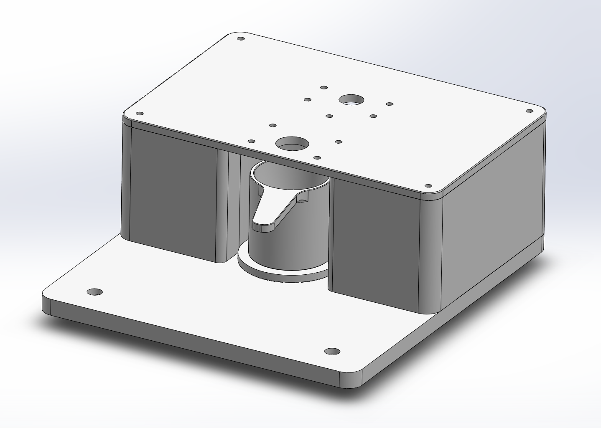

# Housing for US Solid JFDBS00058-100G Scale with OpenTrickler

This folder contains the STL and CAD drawings for a housing that sits on top of a US Solid JFDBS00058-100G scale.

## Description

This housing ensures that the OpenTrickler is aligned with the US Solid scale

## Files Included

- STL - 3D printable models of the housing.
- CAD - SolidWorks CAD drawings that can be modified to suit specific needs.
